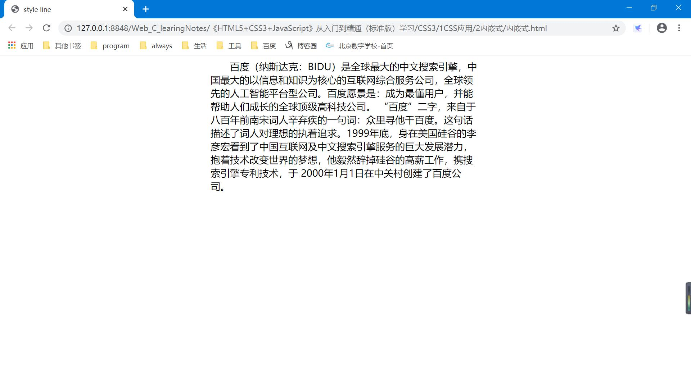

**&emsp;CSS样式代码必须保存在`.css`类型的文本文件中，或者放在网页内的&lt;style>标签中，或者插在网页标签的style属性值中。CSS样式应用的方法主要包括4种：行内样式、内嵌式、链接式以及导入式，下面分别进行说明**

<font size=6>1、行内样式</font>
```html
<!DOCTYPE html>
<html>
	<head>
		<meta charset="utf-8" />
		<meta name="viewport" content="width=device-width, initial-scale=1">
		<title>in line</title>
	</head>
	<body>
		<p style="background-color:#3FACC0">行内样式，控制段落1</p>
		<h2 style="background-color:crimson">行内元素，h2标题元素</h2>
		<p style="background-color:#3FACC0">行内样式，控制段落2</p>
	</body>
</html>
```
**`<p style="background-color:#3FACC0">行内样式，控制段落2</p>`这一句话在代码中重复了两次，所以更改、查看都很不方便**

<font size=6>2、内嵌式</font>
```html
<!DOCTYPE html>
<html>
	<head>
		<meta charset="utf-8" />
		<meta name="viewport" content="width=device-width, initial-scale=1">
		<title>style line</title>
		<style>
			p{
				text-align:left;
				font-size:18px;
				line-height:25px;
				text-indent:2em;
				width:500px;
				margin:0 auto;
				margin-bottom:20px;
			}
		</style>
	</head>
	<body>
		<p>百度（纳斯达克：BIDU）是全球最大的中文搜索引擎，中国最大的以信息和知识为核心的互联网综合服务公司，全球领先的人工智能平台型公司。百度愿景是：成为最懂用户，并能帮助人们成长的全球顶级高科技公司。 
“百度”二字，来自于八百年前南宋词人辛弃疾的一句词：众里寻他千百度。这句话描述了词人对理想的执着追求。1999年底，身在美国硅谷的李彦宏看到了中国互联网及中文搜索引擎服务的巨大发展潜力，抱着技术改变世界的梦想，他毅然辞掉硅谷的高薪工作，携搜索引擎专利技术，于 2000年1月1日在中关村创建了百度公司。</p>
	</body>
</html>
```


<font size=6>3、链接式</font>

通过link标签将外部样式表文件连接到HTML文档中，是最实用的方式，也是最常用的方式

```html
<!DOCTYPE html>
<html>
	<head>
		<meta charset="utf-8" />
		<meta name="viewport" content="width=device-width, initial-scale=1">
		<title>link line</title>
		<link rel="stylesheet" type="text/css" href="lianjie.css"/>
		<link rel="stylesheet" type="text/css" href="lianjie-2.css"/>
	</head>
	<body>
		<p>我是被lianjie-2.css控制的</p>
		<h3>楼上的，<span>lianjie.css</span>文件给我穿的花衣服！</h3>
	</body>
</html>
```
lianjie.css:
```css
h3{
	font-weight: normal; /*取消标题默认加粗效果*/
	background-color:#66cc99; /*设置背景色*/
	height:50px; /*设置标签的高度*/
	line-height: 50px; /*设置标签的行高*/
}
span{
	color:#FF0000; /*字体颜色*/
	font-weight: bold; /*字体加粗*/
}
```
lianjie-2.css
```css
p{
	color:#FF3333; /*字体颜色设置*/
	font-weight:bold; /*字体加粗*/
	border-bottom: 3px dashed #009933;
	line-height:30px;
}
```
